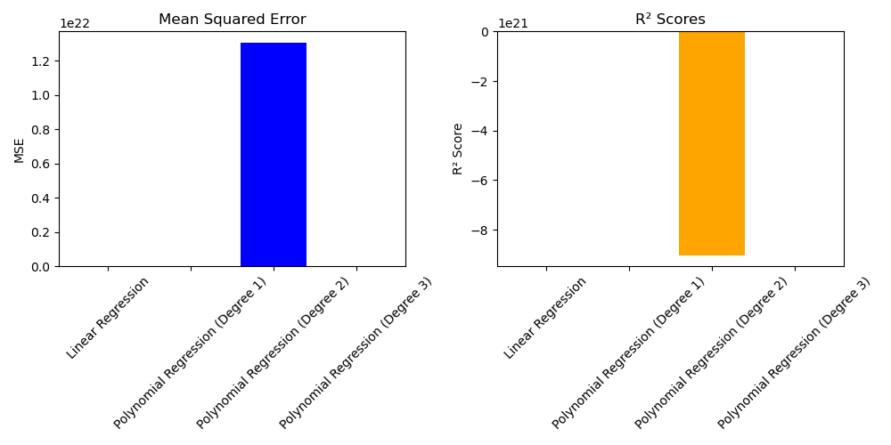
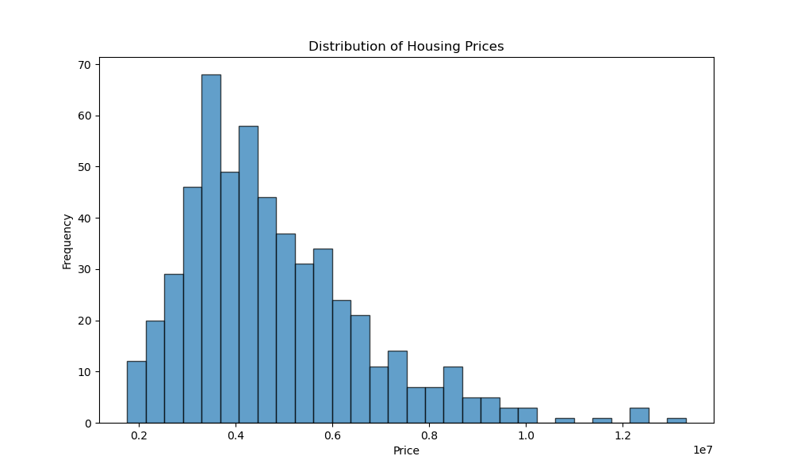
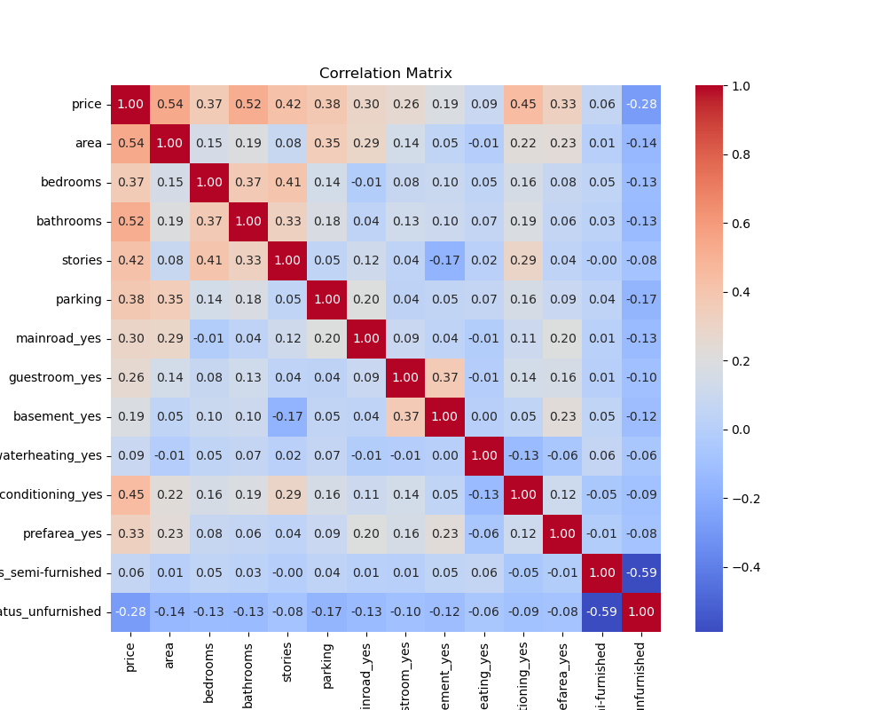
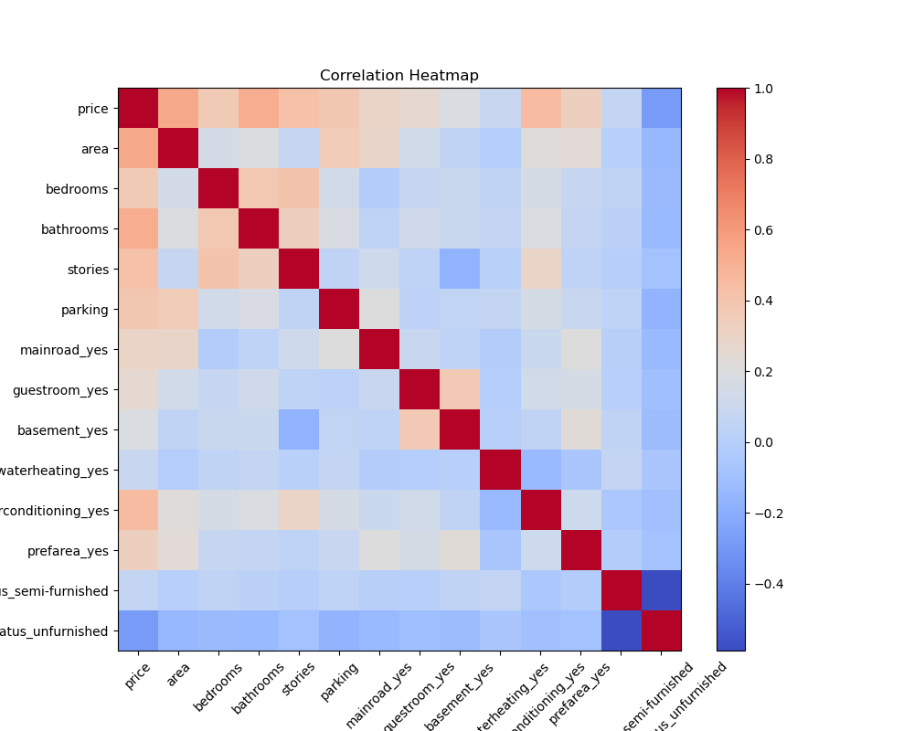
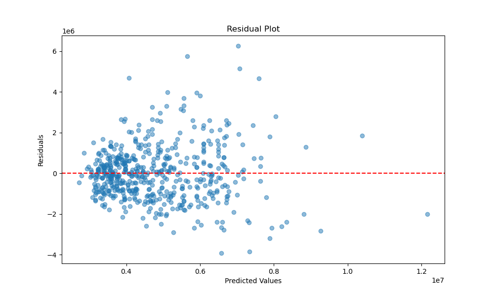

# Housing Price Prediction Project

## Introduction
This project aims to predict housing prices using a dataset that includes various features related to housing. The dataset was analyzed and processed to identify significant predictors of price.

## Methodology
The following steps were undertaken in the analysis:

1. **Data Loading**: The dataset was loaded from a CSV file.
2. **Data Exploration**: Initial exploration included checking for missing values, basic statistics, and visualizations to understand the data distribution.
3. **Feature Selection**: Unnecessary features were removed based on their relevance to the target variable.
4. **Feature Extraction**: Categorical variables were transformed into binary features using one-hot encoding to improve model performance.
5. **Model Training and Evaluation**:
   - **Linear Regression**: A baseline model was created using linear regression.
   - **Polynomial Regression**: The model was extended to include polynomial features to capture non-linear relationships.

## Results

### Model Evaluation Metrics
The following table summarizes the performance of different models:

| Model                          | Average Mean Squared Error | Average R² Score |
|--------------------------------|----------------------------|-------------------|
| Linear Regression              | 0.35                       | 0.63              |
| Polynomial Regression (Degree 1) | 0.35                       | 0.63              |
| Polynomial Regression (Degree 2) | 13061398044323421880320.00 | -9023919449496214306816.00 |
| Polynomial Regression (Degree 3) | 2.43                       | -1.66             |

### Visualizations

## Model Evaluation Plot
The model evaluation plot visualizes the performance of the polynomial regression models across different degrees.

## Exploratory Data Analysis
Here is the distribution of housing prices in the dataset:

## Correlation Matrix
The correlation matrix provides a comprehensive overview of the relationships between features in the dataset.

## Correlation Heatmap
The correlation heatmap shows the relationships between different features in the dataset. High positive or negative correlations indicate a strong relationship.

## Residual Plot
The residual plot visualizes the residuals of the model.

The bar plots above show the Mean Squared Error (MSE) and R² Scores for each model. From the results, we observe that:

- The linear regression model (degree 1) performed the best, with a reasonable balance between bias and variance.
- Higher-degree polynomial regression resulted in overfitting, as indicated by the significantly higher MSE and negative R² scores.

## Conclusions
The analysis highlights the importance of selecting the appropriate model for predicting housing prices. While linear regression provided a satisfactory performance, more complex models did not yield better results due to overfitting.

Future work could involve further feature engineering, using additional data sources, or exploring other modeling techniques such as decision trees or ensemble methods to improve predictive accuracy.
